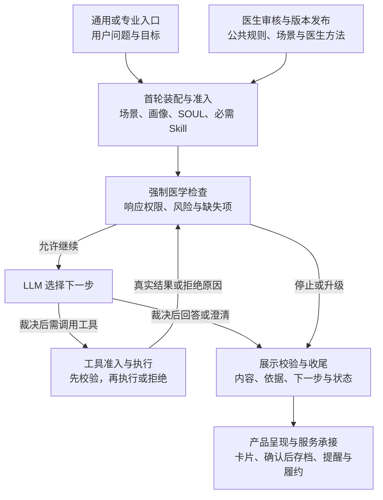

# 母婴医疗引擎与平台建设方案

**以七张审核统计图暴露的问题为建设起点，在母婴场景中建立一套医疗引擎：理解用户情况，判断服务边界，选择咨询方法，交付有依据的结果，并通过医生审核持续改进。** 通用助手与专业医生 Agent 共用这套能力。

本文供领导、医疗、产品和项目共同确定范围与验收。下文为建设方案；已核对的框架机制与待开发部分见[工程附录](engineering.md)。

## 1. 七张图分别推动什么建设

本批包含 **50 条案例、1 位医生；医生可见模型分类，材料审核针对候选内容**。这些数据能定位建设问题，不能直接代表线上完整回复质量、市场需求比例或医生间共识。

| 统计证据 | 暴露的问题 | 对应建设任务 |
| --- | --- | --- |
| [01 样本构成](../../review-query-toolkit/workbench/output/statistical-atlas-20260908/01-sample-and-reasons.png)：39/50 为个体化低风险健康建议；全部猜多数类也有 78% 准确率 | 大量问题需要结合个人情况；总体分数容易掩盖类别差异 | 通用入口支持个性化；分级按类别验收，补少数类别样本 |
| [02 分类表现](../../review-query-toolkit/workbench/output/statistical-atlas-20260908/02-classification-performance.png)：引擎与医生一致 39/50；相对医生标签，8 条低风险被分为受限医疗，3 条一般健康被分为个体化健康 | 服务边界存在分歧，既影响可提供的帮助，也影响约束 | 建立独立的安全分级与裁决能力，逐项复核误升、漏分及理由 |
| [03 修订负担](../../review-query-toolkit/workbench/output/statistical-atlas-20260908/03-material-and-edit-distribution.png)：32 条需修订；回应与追问意见分别有 31、28 条 | 需要改进咨询方法，且意见未必都适用于所有用户 | 回应与追问分别评测；将审核意见按公共、场景和医生方法归属 |
| [04 交叉统计](../../review-query-toolkit/workbench/output/statistical-atlas-20260908/04-classification-material-cross.png)：39 条分类一致中，23 条材料仍需修改 | 分类通过并不代表咨询完成 | 增加完整回复、追问及行动建议的质量校验 |
| [05 场景分层](../../review-query-toolkit/workbench/output/statistical-atlas-20260908/05-scenario-heatmap.png)：含接抱姿、喂养规律共 10 条，9 条材料需修改；母体高风险无样本 | 不同场景缺少的方法和证据不同 | 按场景补方法与风险覆盖；18 个测试分组不直接对应 18 个 Agent |
| [06 画像分层](../../review-query-toolkit/workbench/output/statistical-atlas-20260908/06-profile-age-stratification.png)：5 条缺少日龄，181 天及以上无样本 | 画像存在未知值，已验证人群范围有限 | 结构化并动态更新画像，保留来源、单位、时间和未知；扩展人群前补验证 |
| [07 审核准备度](../../review-query-toolkit/workbench/output/statistical-atlas-20260908/07-review-quality-and-readiness.png)：42 条仅满足筛选规则；6 组对照筛选后仅 1 组完整 | 当前审核尚不足以形成最终验收标准 | 补独立审核、完整对照与最终裁决，建立版本化回放基线 |

由此形成四项共同任务：**校准安全分级、提高咨询质量、适配场景与画像、建立审核迭代机制。** 它们需要在同一次服务中协作，单独提高分类准确率无法覆盖全部问题。

## 2. 产品与引擎分别交付什么

产品面向用户提供两类入口；医疗引擎在后台承担共同判断与执行。近期服务范围以完成验证的母婴场景为准。

| 产品入口 | 用户获得的价值 | 与共同引擎的关系 |
| --- | --- | --- |
| **通用健康助手** | 理解问题，结合个人情况获得日常解释、建议和下一步 | 加载公共及当前场景的方法，按相同安全规则服务 |
| **专业医生 Agent** | 使用指定医生在适用领域的观察重点、追问顺序与指导方法 | 增加该医生确认的方法；沿用公共边界、画像与已确认的咨询进度 |

专业入口应说明方法来源、适用范围及 AI 服务身份，真人服务由实际接入的业务承接。其价值需要通过咨询效果验证，单人审核还不能证明方法独有或普遍更优。

**核心输入**包括用户问题与目标、相关画像、当前场景。画像回答“这个用户目前是什么情况”，场景回答“这次要解决什么任务”；产品与医疗共同确定场景的必需信息、允许能力和完成条件。后续可增加报告、图片和连续记录，每种输入单独验证解析与使用效果。

**核心输出**包括处理状态、回答、依据和下一步动作。用户需要解释时给短答，需要补信息时给问题卡，需要执行时给行动／专项结果卡；真实服务接通后再提供服务卡。底层保留统一结果结构，展示组件可以持续扩展。

例如，一般医学知识场景侧重解释与引用；含接抱姿场景侧重方法与步骤；画像冲突场景先核实事实；触及服务边界时返回允许的信息与服务去向。完成、待补充、不适用、需进一步服务和执行失败应有明确状态。

## 3. 安全分级如何影响实际服务

安全分级必须产生可执行的约束。沿用现有四类标签，以下为拟定的服务策略，具体边界由医疗团队确认：

| 分类 | 服务策略 |
| --- | --- |
| 一般健康 GH | 提供通用健康信息，避免无必要地套用个人画像 |
| 个体化低风险健康建议 PH | 根据已确认事实和用户目标给出适用建议，缺关键条件时澄清 |
| 一般医学 GM | 解释医学知识与证据，保留适用条件，避免无依据地转成个人结论 |
| 受限医疗 RM | 限制超出权限的结论与动作，返回允许的信息及下一步服务去向 |

**这些标签描述响应权限，风险处置另外判断。** 受限医疗不等于急诊，分类一致也不代表医学安全已经得到证明；非健康请求另作范围路由。

每次出现会影响判断的新事实，应重算边界与风险。医学规则规定哪些信息必须核实、哪些动作禁止、何时停止常规咨询；Harness 保证检查实际执行。分类分歧经复核后再调整公共规则，不能为了减少限制而直接降低边界。

## 4. 整体架构：输入、医学能力、受控执行与交付

医学引擎保留四项能力，按场景组合使用：

| 医学能力 | 职责与核心输出 |
| --- | --- |
| **医学边界与风险处置** | 分级、响应权限、风险行动、缺失信息和范围路由；所有入口强制执行 |
| **医学知识与证据查询** | 医学事实、来源、版本、适用条件，以及证据不足或冲突状态 |
| **医学问诊与临床推理** | 更新已知／否定／未知事实，选择下一问，形成受权限约束的摘要；内部可能性不直接作为诊断交付 |
| **医学评估、协议与专项策略** | 执行量表、奶量管理等专项，返回结果、依据及调整／停止条件；明确的计算与规则交给代码 |

产品层管理入口、场景、呈现、长期档案和服务履约；Harness 管理咨询状态、调用与收尾；医学能力负责知识、判断与规则结果。需要澄清时结束当前运行，用户回答后沿用会话继续；后台提醒由产品系统触发，再将新情况交回引擎。

采用 Agent 框架，是为了复用**随新信息选择下一步的执行机制**：LLM → tool_call → 工具结果 → LLM。简单问题可直接回答，复杂问题按需追问、查证据或执行专项；新增方法主要通过配置、Skill 和工具接入。

中间件在调用前准备模型输入，在输出后裁决：无权限工具在执行前被拒绝，缺必需项不计算，澄清时删除同批其他工具调用，超预算返回未完成状态。展示前检查依据、权限与结果一致性，并对待审输出缓冲。提示词提供指导，运行检查落实约束；语义判断质量仍需独立评测。

**建议以 DeerFlow 作为试点基础**，复用已有上下文、SOUL／Skill、澄清、工具控制与前端组合。Pi 的精简内核适合嵌入已有业务外壳；DeepSeek Harness 的插件化组合提供更大定制空间。三者都支持注入、工具循环与交互，当前选择基于接入成本判断，尚无性能对比结论。医学策略、强制首轮装配和展示校验仍需开发，具体特点与来源见[工程附录](engineering.md#4-核对来源)。

## 5. 医生审核如何沉淀为公共与专业能力

先将意见拆成可验证条目，再确认依据、适用范围与负责人。医生的方法可以合理且有特点，是否通用要另外验证。

| 审核资产 | 归属与生效方式 |
| --- | --- |
| **公共规则** | 医疗团队确认的禁止项、风险处置与排除条件，在所有入口强制执行；规则说明与执行策略使用同一版本 |
| **公共 Skill** | 共同确认的咨询方法，如回应原问题、正确使用已知事实，通用与专业入口共同加载 |
| **场景 Skill** | 产品与医疗确定的任务步骤、必需信息与完成条件，按场景加载 |
| **医生 Skill** | 该医生确认的观察重点、方法优先级和沟通步骤，仅在适用入口与场景加载 |
| **知识与专项规则** | 医学结论进入证据库，评分与计算逻辑进入工具；Skill 说明何时及如何使用 |

原始审核中，避免重复询问已知事实可形成公共方法候选；某医生优先介绍的抱姿可形成医生方法候选；必要风险提示进入公共规则审核。三类意见需要不同的确认与发布过程。[审核记录](../../annotation-toolkit/workbench/output/medical-case-review-50-20260907_submitted_20260908_142539.csv)

SOUL 定义角色与表达，Skill 定义方法，画像提供事实。**第一轮前加载公共与场景 Skill，专业入口同时加载医生 Skill，并绑定相应策略。** 必需方法未发布、缺失或未获授权时，返回不可用状态。仅配置 Skill 名称不等于正文已加载，需补强制装配。

未解决的分歧保留待裁决；医生方法不能覆盖公共红线或替用户改变目标。SOUL／Skill 可发布、扩充、回滚，每次咨询固定实际版本；紧急撤销在运行时生效。画像随新确认事实更新，并保留来源与纠正记录。

## 6. 交付与验收：先覆盖关键服务路径，再扩大复用

| 阶段 | 可审阅的交付 | 验收依据 |
| --- | --- | --- |
| **P0：母婴基础闭环** | 通用与一位医生入口；安全分级、场景／画像装配、必要依据、基本澄清、既有专项适配、输出校验与卡片 | 覆盖知识解释、个体化建议、缺信息和受限请求；工程拦截与真实专项接口验证通过，独立医学审核达到约定门槛后试用 |
| **P1：内容与证据完善** | 按图 03—06 的问题扩充场景方法、证据库与画像适配；扩展经核验的专项服务 | 完整回应与追问质量改善，引用支持结论，适用条件保留 |
| **P2：问诊与平台扩展** | 少数主诉的医学路径；第二位医生、新场景、专项及输出组件 | 新事实与修正能影响后续判断；公共规则继续生效，旧场景不退化，接入工作量可量化 |

场景优先级由服务需求、风险、修订问题和数据准备度共同确定；每组仅 0—8 条，不能按图中百分比直接排名。专项先核对接口、规则与失败状态，奶量管理只是其中一个例子。范围和依赖明确后再估算资源与排期。

验收同时看四组结果：**医学质量**看分级误升／漏分、依据与完整咨询审核；**用户价值**看问题解决、下一步理解及实际使用；**运行质量**看时延、失败率和单次完成成本；**平台复用**看新增医生／场景的工作量与资产复用。

按图 07 补新独立审核案例，以及同题不同画像／目标的完整对照。公共要求与医生方法分别评分，允许多种合格表达。各方在试点前约定量化门槛，现有 50 条用于发现问题和回放，不能作为收益证明。

阶段演示要让各方看到：不同母婴场景如何选择服务路径；通用与专业入口的方法差异；缺信息如何接续；越界动作如何被拦截；规则或方法更新如何验证、发布与回滚。

## 7. 分工与当前需要确定的事项

| 角色 | 负责的交付与决定 |
| --- | --- |
| **领导** | 确定投入与服务范围，明确达到什么效果才扩大建设 |
| **医疗与医生** | 确认分类边界、风险规则、证据、医生方法范围与医学验收标准，处理分歧 |
| **产品** | 定义母婴场景、用户旅程、输入输出形态、专业入口差异与用户效果指标 |
| **项目与研发** | 核实接口、数据和审核依赖；分解里程碑，落实执行约束、回放、监测、发布与回滚 |

当前共同确定三项：**P0 覆盖的母婴场景与人群；公共规则及首位医生方法的确认责任人；验收样本、服务接口和资源依赖。** 据此冻结首期范围与验收门槛。后续沿医生、场景、医学能力和输出形态扩展，以服务效果和复用效果决定投入。
