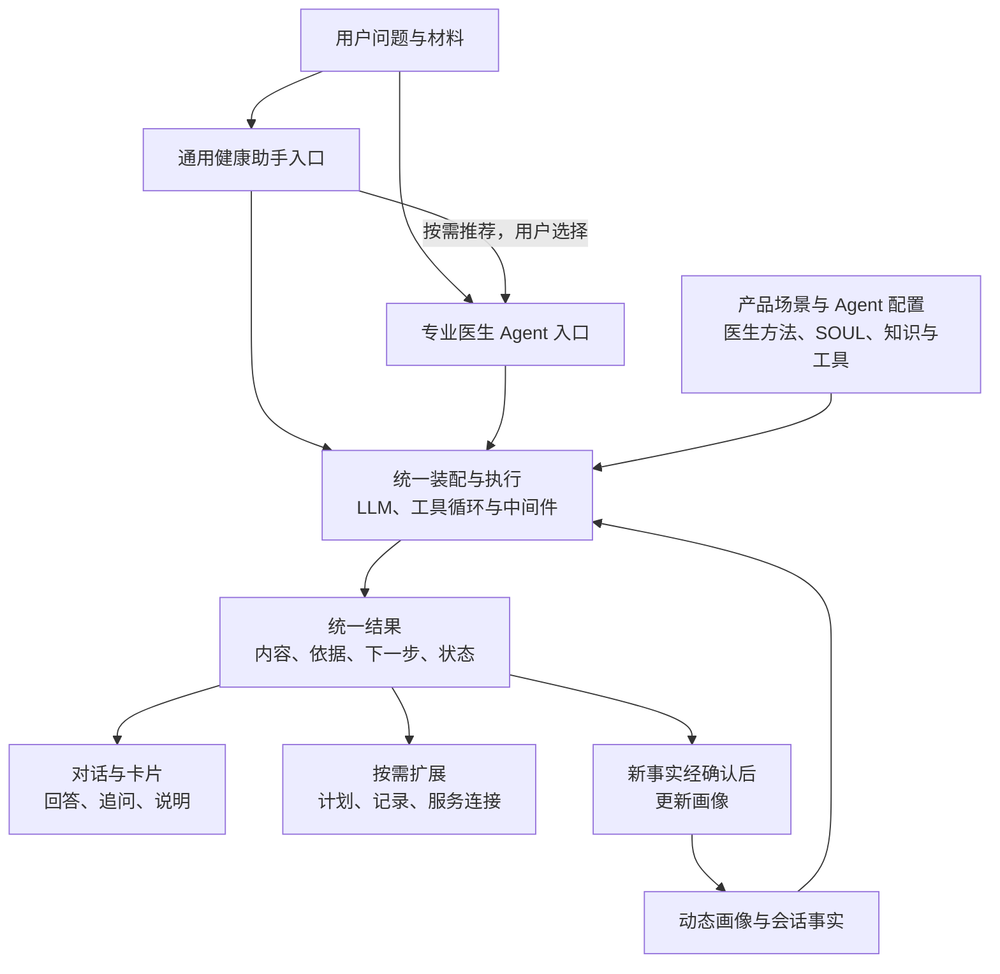
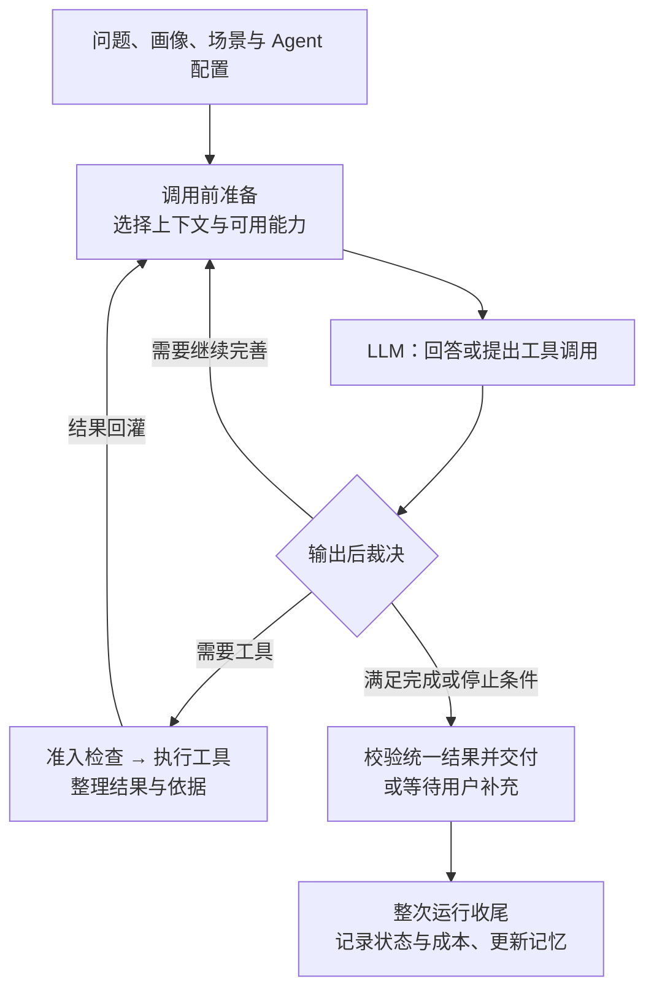
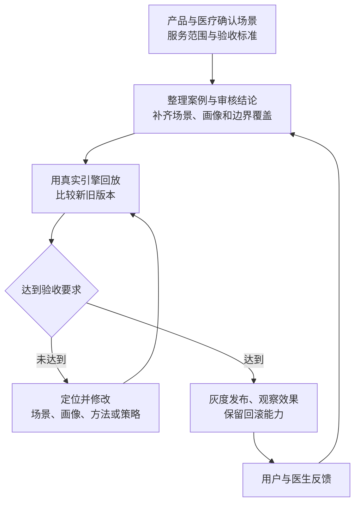

# 医疗 Harness：以场景和画像驱动的一期建设方案

**平台面向用户提供“通用健康助手 + 专业医生 Agent”两类入口，共用一个可持续升级的医疗引擎：场景明确任务，画像补齐背景，医生方法提供专业能力，结果按需要呈现为对话、卡片或服务。** Harness 是其中的执行与控制层，负责模型看见什么、能调用什么、下一步做什么，以及何时完成。

## 1. 一期具体交付什么

建议采用类似蚂蚁阿福的服务组织方式：健康助手承接日常需求，连接专业医生 Agent 与后续服务。阿福的[应用介绍](https://apps.apple.com/cn/app/%E8%9A%82%E8%9A%81%E9%98%BF%E7%A6%8F-%E8%9A%82%E8%9A%81%E6%97%97%E4%B8%8Bai%E5%81%A5%E5%BA%B7%E5%8A%A9%E6%89%8B/id6743828427)与蚂蚁[官方发布](https://www.antgroup.com/news-media/press-releases/1750924800000)分别展示了健康咨询、档案、服务连接，以及医生智能体；以下是据此提出的本平台设计。

| 用户入口 | 提供什么体验 |
| --- | --- |
| 通用健康助手 | 用户直接提问，在已开放的服务范围内回答、补充信息，必要时推荐专业入口 |
| 专业医生 Agent | 用户直接选择，或从通用入口进入；加载该医生确认的方法、知识、适用场景与表达配置，提供专业咨询 |

切换入口时，按授权携带必要画像与咨询摘要，减少重复描述。医生 Agent 明确展示 AI 身份；真人咨询作为独立服务连接。两类入口共用引擎，通过配置组合能力。

一期建议与产品、医疗团队共同确定“哺乳问题即时咨询”，验证通用入口与一个专业医生 Agent，围绕三块能力交付：

| 能力 | 可以实际使用的结果 | 主要责任 |
| --- | --- | --- |
| 场景配置 | 配置服务目标、必要信息、方法与工具、输出要求、完成和转接条件，保存版本 | 产品定义任务与体验，医疗团队确认专业边界 |
| 咨询执行 | 两类入口按场景与画像执行，输出对话及必要卡片，保留过程记录 | 引擎团队实现装配、循环、裁决与状态管理 |
| 质量改进 | 查看失败案例，将医生意见整理为方法或规则候选，比较新旧版本，通过评测后发布 | 医疗团队确认内容，产品与研发共同验收 |

首版用配置与简单审核界面支撑，演示“配置场景与医生能力 → 完成咨询 → 根据反馈改善下一版”。

## 2. 七张图分别支持哪些建设决策

依据[统计图集与精确数据](../../review-query-toolkit/workbench/output/statistical-atlas-20260908/README.md)。共同口径：**50 条案例、1 位医生、可见模型分类的对照审核**；材料是生成阶段的候选内容，尚非线上完整回复评测。下表的建设决策是据此提出的建议。

| 图与事实 | 应建设的能力或采取的行动 |
| --- | --- |
| [01 样本构成](../../review-query-toolkit/workbench/output/statistical-atlas-20260908/01-sample-and-reasons.png)：个性化健康类占 39/50，全部猜该类也有 78% 准确率 | 按产品目标选择试点、补齐少数类别。分别验证服务效果与边界识别，不能把样本分布当市场需求占比 |
| [02 分类差异](../../review-query-toolkit/workbench/output/statistical-atlas-20260908/02-classification-performance.png)：11 处不一致中，8 条从个性化健康升为限制医疗，3 条从一般健康变为个性化健康 | 建立“判断 → 业务动作”的策略：回答、澄清、限制或转接；分别验证误升与漏分，而非统一放松约束 |
| [03 修订负担](../../review-query-toolkit/workbench/output/statistical-atlas-20260908/03-material-and-edit-distribution.png)：32/50 材料需修订；回应有意见 31 条、追问有意见 28 条，二者有重叠 | 将回应与追问分别定义标准，整理可复用的咨询方法；修改意见需确认成完整要求，不能直接当标准答案 |
| [04 交叉统计](../../review-query-toolkit/workbench/output/statistical-atlas-20260908/04-classification-material-cross.png)：分类一致的 39 条中，23 条材料仍需修订 | 分类通过后仍要检查是否解决问题、是否尊重目标、追问是否必要；最终验收必须回放真实引擎的完整回复 |
| [05 场景分层](../../review-query-toolkit/workbench/output/statistical-atlas-20260908/05-scenario-heatmap.png)：含接抱姿、喂养规律两组共 10 条分类一致，9 条材料需修订；母体高风险无样本 | 前两组适合作为方法改进试点；高风险覆盖需补。业务主题与跨场景控制能力分开建设，不能把 18 个测试分组直接当 18 个产品场景 |
| [06 画像分层](../../review-query-toolkit/workbench/output/statistical-atlas-20260908/06-profile-age-stratification.png)：日龄有 5 条未提供、181 天以上无样本，组间表现不同 | 建立结构化画像，保留精确日龄、单位、未知值；按“场景 × 画像”验证，不从小样本差异推断年龄因果关系 |
| [07 证据准备度](../../review-query-toolkit/workbench/output/statistical-atlas-20260908/07-review-quality-and-readiness.png)：42 条仅满足筛选规则；6 组对照仅 2 组完整，筛选后仅余 1 组 | 补齐审核语义、版本引用和对照组，再形成评测基线；新增独立审核案例，验证方法是否有效 |

这批证据指向三个建设重点：**服务任务定义、咨询过程质量、可验证的改进机制。** 分类标签表示业务边界，不等于就医紧急程度；各分组样本很小，不能据此宣布场景能力已成熟。

## 3. 核心输入与输出怎样持续扩展

**场景决定做什么，画像决定为谁做，医生配置决定使用哪些专业方法。** 场景由产品与医疗团队共同确定任务、必要信息、可用能力、交付结果和完成条件；入口负责选用或推荐场景，需求不清时先澄清。

| 核心输入 | 一期内容与补充方式 |
| --- | --- |
| 当前问题与材料 | 先接文字与会话事实；后续按场景接图片、报告、语音等，保留原始材料与来源 |
| 用户画像 | 服务对象、阶段、目标、偏好与已确认事实，按相关性动态注入；纠正和新事实进入下一轮，母亲与婴儿分别记录 |
| 场景与 Agent 配置 | 产品任务、边界、输出要求，以及通用或医生方法、SOUL 角色与表达配置；按版本加载 |
| 知识与工具 | 按需检索依据、调用服务，结果回灌下一轮；新增能力通过注册与权限配置接入 |

同样问“要不要加泵”，增加奶量与减轻负担两种目标应影响回应；同一用户进入即时咨询与随访，任务和完成条件也会不同。未知、冲突与来源应保留，不能把模型推测直接记为画像事实。

引擎统一输出**内容、依据、下一步动作与运行状态**，前端按场景选择呈现；无需每次展示全部类型。

| 输出形态 | 用户得到什么 | 建设顺序 |
| --- | --- | --- |
| 回答与追问 | 直接回应诉求，必要时用选项或补充信息卡收集事实 | 一期 |
| 依据与说明卡 | 展示引用来源、适用条件和需要注意的信息 | 一期 |
| 专业入口或服务卡 | 选择医生 Agent；接通真人服务时展示实际可用的服务与状态 | 一期先验证 Agent 切换，服务逐步接入 |
| 计划、记录与报告 | 保存行动清单、查看变化、安排授权随访 | 后续按产品场景扩展 |

输入和输出约定保留版本与可选扩展项：增加一种材料、医生方法或卡片时，补接入、校验与呈现即可复用主循环；不支持的新卡片回退为可读内容。卡片只是展示或操作入口，实际预约、记录、随访等由工具按权限和用户意愿执行，返回真实状态。

图 05 的业务主题进入方法与知识库，信息充分性、画像冲突等作为公共控制能力，18 个测试分组不直接对应 18 个 Agent。医生意见先形成有适用条件的方法候选，经本人或医疗团队确认、评测后发布；通用方法与医生配置分别积累。

## 4. Harness 怎样把这些能力组织起来

DeerFlow 的核心是 `LLM → tool_call → 工具结果 → LLM` 循环。模型选择下一步，中间件在调用前准备输入、返回后裁决，工具结果再回灌给模型。

| 中间件位置 | 负责的控制 |
| --- | --- |
| `before_agent` | 选定场景与 Agent 配置版本，准备状态与资源 |
| `before_model / wrap_model_call` | 装配本轮画像、历史、方法与工具，控制上下文预算 |
| `after_model` | 裁决回答和调用，决定继续、澄清或结束 |
| `wrap_tool_call` | 校验权限与参数，处理失败，保留工具结果 |
| `after_agent` | 保存记录、提交记忆更新、释放资源 |

表中医疗场景逻辑是拟建能力，通过这些位置接入。**每轮模型返回都要裁决，整次运行结束才收尾。** 方法指导模型如何做，场景边界和展示前检查由引擎执行；不要求每个检查都再调用一个模型。

## 5. 为什么优先借鉴 DeerFlow

| 方案 | 特点与取舍 |
| --- | --- |
| [DeerFlow](https://github.com/bytedance/deer-flow) | 运行管理、中间件、记忆与工具配套较完整，适合本期装配场景能力；需要裁剪框架并理解执行顺序 |
| [Pi](https://github.com/earendil-works/pi/blob/main/packages/coding-agent/README.md#philosophy) | 小内核、易嵌入，工作方式通过扩展实现；上层平台已完整、只缺执行内核时适合，更多集成与治理需自行组合 |
| [DeepSeek Harness](https://github.com/deepseek-ai/deepseek-harness/blob/master/docs/architecture.md) | 模型、工具、会话和循环都可作为插件替换；深度定制自由度高，需管理组合，官方仍标注[开发者预览与兼容性变更](https://github.com/deepseek-ai/deepseek-harness#developer-preview) |

三者都能实现上下文与工具扩展。本期优先借鉴 DeerFlow，是为了利用现成控制位置和已有源码研究积累，将投入集中于场景、画像和医疗方法。先复用现有模型调用、检索和工具接口，以真实咨询回放决定接入范围。场景、方法和评测资产由平台独立持有，保留替换内核的空间。

## 6. 怎样建设、验收和继续扩展

一期交付两类入口、一个确认的咨询场景与医生配置、必要的对话和卡片，以及回放案例与对比报告。重点演示：**同题不同画像能适配；进入医生 Agent 后方法与输出符合配置，必要上下文能接续；新增一种卡片或修订方法后，原有场景仍通过回放。** 图 05 的前述两组用于内容改进，画像对照、信息冲突和高风险用例用于覆盖控制边界。

验收分别看分类误升/漏分、回应是否解决问题、追问必要性、画像使用和场景完成度；同时补采响应时间、成功咨询成本、修改工作量与后续使用情况。当前七张图没有这些运营结果，不能据此估算收益。

通过试点后，接入第二个医生与新场景，验证公共能力复用；再扩充材料输入、计划与记录卡、授权随访和真实服务连接。平台按“输入来源、专业能力、输出组件”分别升级，以回放效果与接入成本决定扩展节奏，保留版本和回滚能力。

---

原理参考：[工厂装配](../../../deerflow-engineering-notes/site/src/content/tutorials/zh/02-lead-agent-factory.mdx)、[输入准备](../../../deerflow-engineering-notes/site/src/content/tutorials/zh/04-middleware-pipeline.mdx)、[输出裁决与收尾](../../../deerflow-engineering-notes/site/src/content/tutorials/zh/05-middleware-return.mdx)（DeerFlow 笔记基线 `7e7f0410`）。统计依据：[七张图](../../review-query-toolkit/workbench/output/statistical-atlas-20260908/gallery.md)、[精确数据](../../review-query-toolkit/workbench/output/statistical-atlas-20260908/chart-data.json)。外部项目状态核对日期：2026-09-09。
