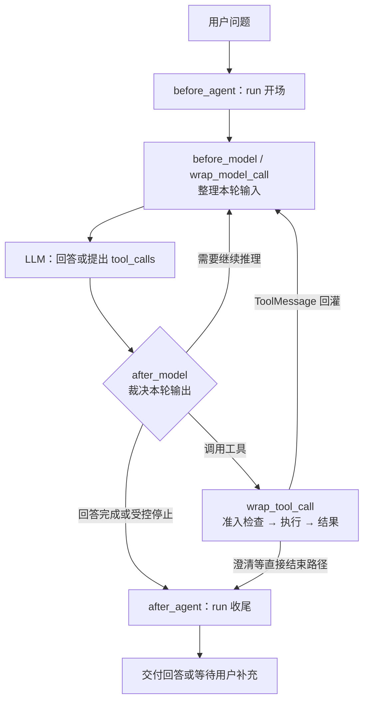
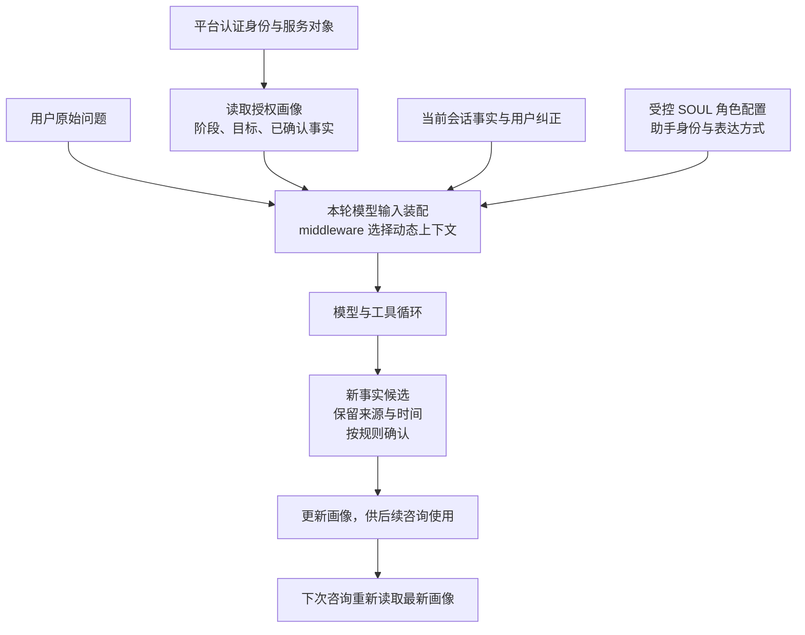
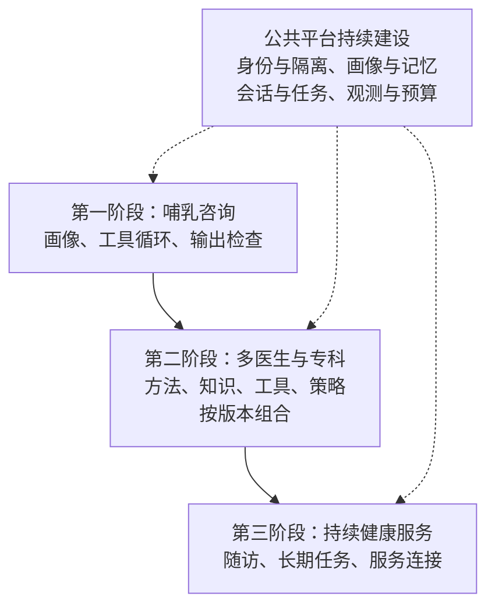

# 一起医疗：引擎原理与 ToC 平台建设

一起医疗要建设的能力是：**用户提出问题，平台带入对这个人的了解，组织模型、知识与工具完成咨询，并把经过确认的新信息用于后续服务。** 同一个引擎可以承载不同医生、专科和服务场景。

本文是建设方案。DeerFlow 原理与一起医疗拟建能力分别说明；选型资料核对于 2026-09-09。

## 1. DeerFlow 的原理：模型与工具循环，middleware 控制执行

`create_agent()` 提供 `LLM → tool_call → 工具结果 → LLM` 循环。模型提出下一步动作，运行时执行工具、回灌结果并决定是否继续。一次用户请求形成一个 run，里面可能调用模型多轮。

middleware 围绕循环提供明确的介入位置，具体能力按配置启用：

| 位置 | 负责什么 |
| --- | --- |
| `before_agent` | 准备本次运行的上下文与资源 |
| `before_model` | 每轮整理历史、摘要和需要补充的信息 |
| `wrap_model_call` | 调整模型实际收到的消息、工具与预算，处理调用异常 |
| `after_model` | 检查模型输出，限制重复动作、裁剪调用，决定继续或结束 |
| `wrap_tool_call` | 工具执行前检查权限，执行后处理错误与结果大小 |
| `after_agent` | 提交记忆更新、释放资源、清理运行中的临时记录 |

**每轮裁决不等于整次收尾。** 工具结果回来后仍会经过下一轮输入准备；没有 tool_call 的回答也可能被要求继续完善。`before_*` 按注册顺序执行，`after_*` 逆序执行，`wrap_*` 层层包裹，因此中间件顺序属于运行逻辑。取消和崩溃还需宿主兜底清理。

依据工程笔记的[工厂装配](../../../deerflow-engineering-notes/site/src/content/tutorials/zh/02-lead-agent-factory.mdx)、[输入准备](../../../deerflow-engineering-notes/site/src/content/tutorials/zh/04-middleware-pipeline.mdx)、[裁决与收尾](../../../deerflow-engineering-notes/site/src/content/tutorials/zh/05-middleware-return.mdx)，原理基线为 `7e7f0410`。医疗内容审核需由一起医疗实现；DeerFlow 的模型安全停止信号处理不承担医学判断。

## 2. 为什么优先借鉴 DeerFlow，怎样看 Pi 和 DeepSeek Harness

三者都能支持模型与工具循环，并通过扩展介入上下文和执行。差别在于默认提供多少配套，以及我们要承担多少组装工作。

| 方案 | 特点 | 对一起医疗的取舍 |
| --- | --- | --- |
| [DeerFlow](https://github.com/bytedance/deer-flow) | Python 运行体系，将 middleware、记忆、工具、沙箱和子任务串起来 | 适合沿现成边界接入医疗能力；框架较重，需要裁剪和理解状态、顺序与宿主的关系 |
| [Pi](https://github.com/earendil-works/pi/blob/main/packages/coding-agent/README.md#philosophy) | TypeScript 小内核，SDK/RPC 易嵌入；通过扩展组织工作方式 | 已有完整平台、只缺执行内核时很合适；MCP、子任务、权限流程等需要另行组合 |
| [DeepSeek Harness](https://github.com/deepseek-ai/deepseek-harness/blob/master/docs/architecture.md) | 基于 Cordis 的插件体系，模型、工具、会话乃至循环都可替换 | 适合深度定制运行机制；需治理插件依赖与组合，官方目前仍标注[开发者预览和兼容性变更](https://github.com/deepseek-ai/deepseek-harness#developer-preview) |

**本方案优先借鉴 DeerFlow 的运行结构，并把它作为首个接入验证对象。** 当前重点是组织画像、医疗工具和裁决机制，已有源码笔记可以减少理解与集成成本。若只需轻量内核，认真比较 Pi；若需要替换底层循环，再验证 DeepSeek Harness。整套迁移范围由同一批咨询任务的质量、延迟、成本和改造量决定。

## 3. 用户只需提问，画像由平台动态注入

贯穿案例：用户问“最近喂奶太累了，怎么办？”平台需结合她当前的阶段、已知情况和目标，决定还缺什么信息、如何继续咨询。

**SOUL 说明助手如何服务，画像说明正在服务谁。** 二者都由平台装配，但画像以用户事实进入上下文。用户原话保留，母亲与婴儿等不同对象分开记录。

新一轮咨询读取最新画像；工具带回新事实或用户纠正后，下一次模型调用刷新相关上下文。阶段信息按日期更新，冲突与未知项明确保留，必要时追问；模型推测需确认后再写入长期画像。

DeerFlow 笔记中的 DynamicContext 已展示隐藏上下文注入，但其日期、记忆刷新策略有限。这里的按用户、场景和事实变化刷新，是一起医疗要扩展的能力。采用稳定角色配置加动态事实上下文，可减少重复提示并保持信息来源清楚。

## 4. 医疗能力怎样装进同一个引擎

| 组件 | 承载的能力 | 扩展方式 |
| --- | --- | --- |
| SOUL / 角色配置 | 服务身份、沟通风格 | 切换经配置的角色 |
| 画像与记忆 | 服务对象、阶段、目标、已确认事实 | 增加场景字段与更新规则 |
| Skill / 医生方法 | 追问顺序、信息组织、解释方法 | 加入有适用条件和版本的方法 |
| 知识与 Tool/MCP | 检索依据、读取记录、连接服务 | 接入知识源和业务接口 |
| middleware | 上下文选择、工具准入、输出检查、停止与收尾 | 加入公共策略或专科检查 |

案例中，画像减少重复询问，Skill 帮助组织咨询，工具提供事实与依据，middleware 检查动作和回答是否满足约束。**Skill 指导模型，执行边界由运行时落实。** 医学知识保留来源；医生表达偏好与公共约束分别管理。

首版优先复用现有咨询链路中的模型调用、检索和工具接口，补齐动态画像与公共控制边界。输出检查应明确发生在内容展示前；新增医生或场景，通过角色、方法、知识和策略的组合接入。

## 5. 给老板看三个演示，证明平台价值

| 演示 | 应看到什么 | 如何判断有效 |
| --- | --- | --- |
| 同题不同画像 | 同样问“喂奶太累”，按阶段和本人目标改变追问与回应 | 相关性、必要追问、医生评价 |
| 同人连续咨询 | 再次咨询接续已知事实，纠正信息后及时调整 | 重复询问率、事实更新正确率 |
| 新增医生或场景 | 复用引擎，装配新方法与工具，并展示一次拦截或降级 | 接入工作量、复用比例、失败处理 |

演示同时展示选用了哪些画像字段、调用了什么工具、为何继续或结束。记录首次有效响应时间、咨询完成率和每次成功咨询成本，让质量与运营代价一起可见。

## 6. ToC 平台怎样建设和扩展

第一阶段验收画像差异、连续咨询和受控执行的回放；第二阶段用第二个场景检验复用，建立能力配置与版本管理；第三阶段再加入调度、等待与恢复，按用户授权开展随访和服务操作。

各阶段都持续运行 **反馈 → 定位组件 → 修改 → 回归评测 → 灰度发布与回滚**。医生意见归到画像、知识、方法或控制策略，经确认和评测后发布。平台长期积累的是可更新的用户理解、可复用的医疗能力，以及能证明改进有效的运行记录。
