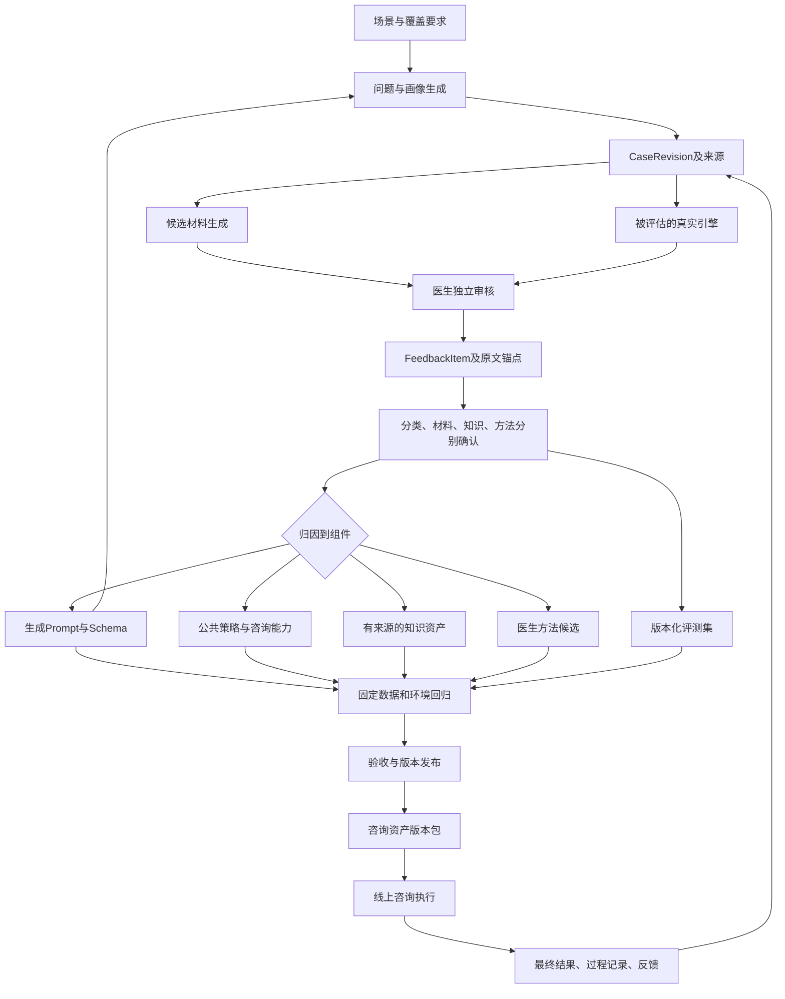

# 现状与目标架构

## 1. 现状：已有链路与真实断点

| 环节 | 当前实现与证据 | 已有能力 | 需要补齐 |
| --- | --- | --- | --- |
| 问题生成 | `langfuse-toolkit/prompts/questions.system.txt`，`definitions/questions.json`，QuestionOutput v2.0.0 | 18场景、独立问题和画像、来源ID、对照组、目标差异 | 生成批次与实际 Prompt 版本、模型参数、原始 Output 的不可变关联；人物主体歧义和意外冲突检查 |
| 候选问诊材料 | `langfuse-toolkit/prompts/review.system.txt`，ReviewOutput v4.0.0 | 候选分类、初步判断、回应方向、0–2条追问；明确供医生核实 | 引入已确认的公共规则/医生方法引用；保留每次生成版本；不要以生成器的候选标签评判自己 |
| Prompt 维护 | `app/projects/prompts.py::create_version/assign_labels`，`prompt_definitions.py::version_payload` | 创建版本、标签指向、写后读取核对；省略的 config/tags 继承服务端 | 本地定义尚未绑定生成批次全部参数；将历史运行快照和新版本发布记录关联，禁止把 latest 当历史版本 |
| Output 收集 | `output-collector-toolkit/index.html`，后端 Workspace 模型 | case_id 合并、同编号冲突阻止、问诊替换、JSON备份、工作空间 revision | 工作空间 revision 不是单条案例历史；显式 CaseRevision/DraftRevision 与生成运行ID |
| 离线安全分类 | `prompt-agent/classify.py`，`app/safety_classifier.py` | 只输入 query、JSON画像和短期历史；结构化输出；run.json 记录输入/Prompt/输出摘要及模型 | 与线上同源组件和相同输入契约；错误、回退、策略下限、原模型标签分开统计 |
| 医生审核 | `annotation-toolkit/app/profiles/cozie_medical_review.py`、审核规范 | 人工分类、边界、理由、素材处置、修改意见、专家请求 | 评论类型和范围显式化；绑定被审版本；分类、材料、知识及方法分别确认 |
| 审核查询 | `review-query-toolkit/app/evaluation.py` | 全量/筛选口径、混淆矩阵、素材交叉、分组、填写问题 | 反馈 → 原因假设 → 组件 → 修改任务 → 回归结果的关联台账 |
| 线上咨询 | `cozy_agent/backend/app/agents/lactation/agent.py::astream` | 输入组装 → 安全分类 → RAG/MCP + SDK Run → 输出审核 → 最终结果 | 明确可替换组件边界、医生方法资产选择、输入对齐与回放证据；保留当前运行链路 |

### 本次已经核实的来源

医生50条导出能全部关联到 `annotation-toolkit/workbench/input/cases-2026-09-07T01-19-57-173Z.csv` 的100条源数据。逐条比较原问题与使用现有 `_profile_materials` 渲染后的画像：**50/50一致、0条缺失、0条不匹配**。

对应 `cases-2026-09-07T01-19-57-173Z_engine.run.json` 的输入文件摘要与该100条 CSV一致；Prompt摘要与当前 `prompt-agent/prompt.md` 一致。该运行使用 `gpt-5.6-sol`，100条中99条生成分类。此次医生审核子集的50条均有分类输出。

这证明当前这批输入和分类运行的关联，**不证明两个生成 Prompt 的历史 Langfuse 版本**。后者仍缺少绑定到每批 Output 的证据。

本批审核界面同时展示候选分类和引擎判断（`record_spec`中的`candidate_materials/model_assessment`），因此属于对照审核，不能声称这些人工标签来自独立盲审。未来基线标签应先隐藏模型标签独立判断，再进行差异裁决；素材质量审核另行展示待评材料。

### 三处必须优先修复的可重复问题

1. **审核导出不能直接回放。** 对医生 CSV 实际运行 `load_safety_cases`，在首条数据报 `invalid context JSON: Expecting value`。导出 `user_profile` 是给医生阅读的 Markdown，不是原始 JSON。应恢复源数据后关联审核，不解析 Markdown 猜造输入。
2. **离线与线上不是同一分类实验。** 线上 `shared/safety_classifier.py::CLASSIFIER_INSTRUCTIONS` 多出“不确定时选择更严格”的原则；`_classification_payload` 发送 query、短期历史、规范化问题、平台风险，却不发送 lactation 画像。离线发送 user_profile。不能把离线78%直接认作线上成绩，也不能只修改离线 Prompt 期待线上变化。
3. **业务画像契约不同。** 合成数据有 `baby_age_days/stage/background`；线上 `LactationProfile` 主要有 `baby_age_months/postpartum_day/...` 且忽略未知字段。直接塞原画像会丢字段。日龄边界不能用统一除以30偷偷换算，需保留精确单位、来源与未知值。

另外，`cozy_agent/AGENTS.md` 中“工厂仍返回待开发”的描述与当前工厂、README中的 lactation 实现不一致。此次按源码判断现状；W00要求在后续代码变更前统一该文档事实，不能据旧说明重建已有业务链路。

## 2. DeerFlow 借鉴点：具体到代码与边界

下表的 DF 编号供任务清单引用。这里只说明已读源码所支持的机制；医疗领域能力是本方案新增设计，不是 DeerFlow 自带能力。

| 编号 | DeerFlow 代码证据 | 可以借鉴的机制 | 对应本系统的落点 |
| --- | --- | --- | --- |
| DF01 | `backend/tests/test_harness_boundary.py` | harness 不依赖 app，AST检查导入方向 | Gateway 管生命周期；共享咨询能力不依赖某医生；医生方法依赖公共接口。沿用现有 Agents SDK 和 factory 边界 |
| DF02 | `agents/features.py::RuntimeFeatures`；`lead_agent/agent.py::build_middlewares` | 显式组合与顺序约束，可替换实现；guardrail没有自动赠送的领域实现 | 拆开输入选择、分类、检索、方法选择、生成、输出审核；用明确输入输出和顺序组装，而不是复制 LangGraph 的 Middleware 类型 |
| DF03 | `skills/types.py`、`skills/catalog.py`、`skills/describe.py` | 元数据发现与技能内容加载分开，按需选择 | 医生方法注册表：适用场景、版本、证据、状态、工具范围；只装载当前任务需要且已批准的资产 |
| DF04 | `middlewares/skill_tool_policy_middleware.py` | 被发现/启用不等于被激活；实际上下文中的技能才影响工具权限，且有执行侧限制 | 选医生不自动获得更多权限；DoctorMethod不能降低公共安全策略或放宽工具权限；正文偏好与能力授权分开 |
| DF05 | `middlewares/durable_context_middleware.py`；`agents/thread_state.py` | summary、委派记录、技能上下文作为结构化状态；历史内容按数据处理 | 事实来源、用户目标、未解问题、已激活方法版本分开保存；医生评论和用户记忆不升级成系统规则 |
| DF06 | `subagents/report_contract.py`、`subagents/status_contract.py` | 委派任务有输出契约、状态和可核验交付引用 | 离线可委派“证据检索、规则候选抽取、反例生成”；结果只是建议，需证据和审核。线上首版不要求多Agent并行 |
| DF07 | `middlewares/tool_receipt_middleware.py`、`receipt_verification.py` | 执行侧记录工具证据；报告不能凭“完成”自证；核对是 advisory | RAG确实返回了哪些文档、规则确实激活了哪个版本、候选确实跑过哪条用例都要有记录；调用成功不代表医学正确 |
| DF08 | `agents/memory/manager.py::MemoryManager` | 记忆后端接口及 user/agent 隔离 | 患者记忆由现有平台拥有；医生方法库另行版本管理；不能把一位医生意见自动写成所有人的永久记忆 |
| DF09 | `runtime/checkpoint_state.py`、`runtime/events/`、`client.py` | 状态读写入口、事件记录、明确的有状态/无状态执行语义 | 离线批次可按已持久化的条目续做；等医生的任务写成 pending 状态，结束当前 Run；不让模型循环等待人工 |
| DF10 | `scripts/benchmark/deermem_eviction/config.py`、`manifest.py` | 固定数据revision/hash、Prompt hash、参数、grader和样本选择 | 每次实验固定输入快照、完整资产包、模型/检索条件与裁判版本；离线回放调用被评估实现，不复制另一套“相似实现” |

重要差别：DeerFlow 的 receipt 核对只能证明动作与记录对应，不能验证医学结论；其 RuntimeFeatures 中 guardrail 是待注入能力，不意味着装上 DeerFlow 就具备医疗安全保障。`rfc-create-deerflow-agent.md` 里的API提案也不能替代当前 `client.py` 的实际签名。

可在线核查的官方源码：[RuntimeFeatures](https://github.com/bytedance/deer-flow/blob/main/backend/packages/harness/deerflow/agents/features.py)、[依赖边界测试](https://github.com/bytedance/deer-flow/blob/main/backend/tests/test_harness_boundary.py)、[技能与工具策略](https://github.com/bytedance/deer-flow/blob/main/backend/packages/harness/deerflow/agents/middlewares/skill_tool_policy_middleware.py)。详细判断主要来自本地固定提交的源码，文件摘要在证据包中。

## 3. 目标：两条链路、四种资产

四种资产分别维护，不能揉成一个总Prompt：

1. **Policy**：安全边界、信息权限、失败策略、工具权限。独立于医生的风格偏好。
2. **Knowledge**：可检索的领域事实、适用人群和条件、来源、审定与更新日期。医学判断的依据归此层。
3. **Procedure/Skill**：一类咨询怎么组织事实、识别目标、选择必要追问、使用证据、给可执行帮助。通用或专科共享，但须定义输入和退出条件。
4. **DoctorMethod**：该医生选择的解释顺序、技术偏好、措辞方式、同等合格方案的排序。必须依赖适用条件和证据，不能覆盖前面三层的硬约束。

`Prompt` 是这些资产装配到模型输入的产物之一。`Memory` 保存对这个人/会话的事实，不负责未经审定的知识或方法推广。

## 4. 线上运行：沿用现有内核，明确组件

这是责任边界，**不要求每个方框再调用一个LLM**。目标与问诊计划可以是同一主Run内的结构化中间结果；先用可测试的输入组装、确定规则和已有工具完成，只有实验能证明需要时才增加模型阶段。

执行约束：

- C保留 query、规范化问题、精确日龄、主体、目标、已知/未知/冲突，以及逐字段来源。平台原句、医生批注、检索内容都以数据身份进入。
- P至少区分“模型分类”“平台策略下限”“失败回退”“最终策略”。标签不当作急诊等级；不确定性和信息缺口单列。现有下限不因本批低风险意见直接放宽。
- S由可信配置决定医生身份和可用版本。患者请求可以表达风格偏好，不能自行指定未经批准的方法版本或修改权限。
- R保留 request_id、doc_id、chunk_id、文档版本与适用范围。当前工具投影只留文本、标题和页码，需要补内部证据记录；给模型的正文可保持简洁。
- A输出面向用户的完整答复，不把候选材料的“可先说明……”直接作为线上回复；追问0条也可合法。
- V分别评估安全约束、证据支持和任务完成度，避免用一套安全规则替代“有没有回答用户问题”。当前语义审核发生在正文流出之后，需在W14验证撤回和最终状态，不把最终安全结果误报成从未暴露过内容。
- O以现有最终 RunResponse 为权威，保存完整版本包引用和可检索的事件；患者个人数据不进入公共组件注册表。

## 5. 差距归因与实验设计

每条反馈同时允许“观察事实”和“原因假设”。医生指出追问太吓人，证明存在这条审核意见；它本身不能证明唯一原因是分类器过严或哪段Prompt导致。

| 差距类型 | 核实方法 | 修改落点 | 必须保留的对照 |
| --- | --- | --- | --- |
| 输入/画像错误 | 比较 source revision、query/profile、字段丢失、对照变化 | 问题生成器、Schema、输入适配 | 原输入和修订输入分开，不继承旧标签 |
| 分类边界差异 | 同输入、同推理参数，核对人工分类、未决状态 | 安全策略定义、分类器、上下文选择 | 高约束/普通案例均保留，不只看误升下降 |
| 回应未解决诉求 | 对照医生确认的任务要求，不只比措辞相似 | 回复过程组件和候选材料Prompt | 固定分类、固定知识，单独比较回复策略 |
| 追问不必要或有引导性 | 标明追问要改变的决定、已知信息与缺口 | 公共追问选择器/专科方法 | 需要追问、无需追问、急迫行动不等待追问三类 |
| 医学事实/操作建议争议 | 文献或知识库来源+专业审定+适用条件 | Knowledge，不先写入医生风格 | 文档版本、适用/不适用反例、来源冲突 |
| 医生风格/方法差异 | 同安全和知识条件下的盲评、医生本人确认 | DoctorMethod配置或技能 | 公共组件单独运行 vs 公共组件+医生方法 |
| 工具/检索/输出审核问题 | 核查实际请求、检索结果、guardrail事件和最终输出 | Harness工具适配/审核组件 | 固定检索fixture和真实RAG实验分别报告 |
| 审核流程矛盾 | 原始选项、意见范围、被审版本与审核人 | 标注契约与裁决流程 | 原始响应不可改写，只新增确认记录 |

已被当前50条用于分析和规则设计的样本属于开发/诊断集，不能再宣称是未见测试集。新采样的留出集以 `source family/pair_key` 分组隔离，不能把同一对照组两条分到训练和测试。

## 6. 发布与回流的终点

一次改进关闭的条件为：反馈来源可定位 → 已确认或已明确拒绝 → 归因组件与任务明确 → 修改有版本 → 同版本数据回归完成 → 应用配置实际引用该版本 → 线上证据能回指 → 如退化可恢复旧版本。

发布一个 `ConsultationBundle`，固定策略、回复模板、公共组件、医生方法、知识库、模型配置、输入Schema和评测版本；不要只给Prompt打一个 production标签就视作整个引擎发布完成。

初期沿用当前单进程Gateway和现有SDK运行方式。离线持久化的是工作项与批次结果；暂停等待医生时存储 pending 项并结束执行。无需为了模仿DeerFlow预先引入多worker、分布式调度、线上shell或额外长期记忆服务。
