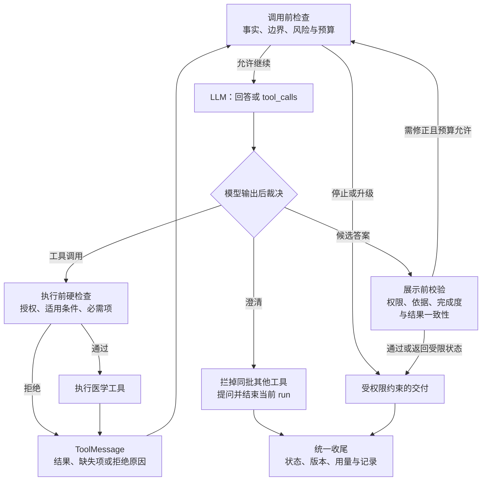
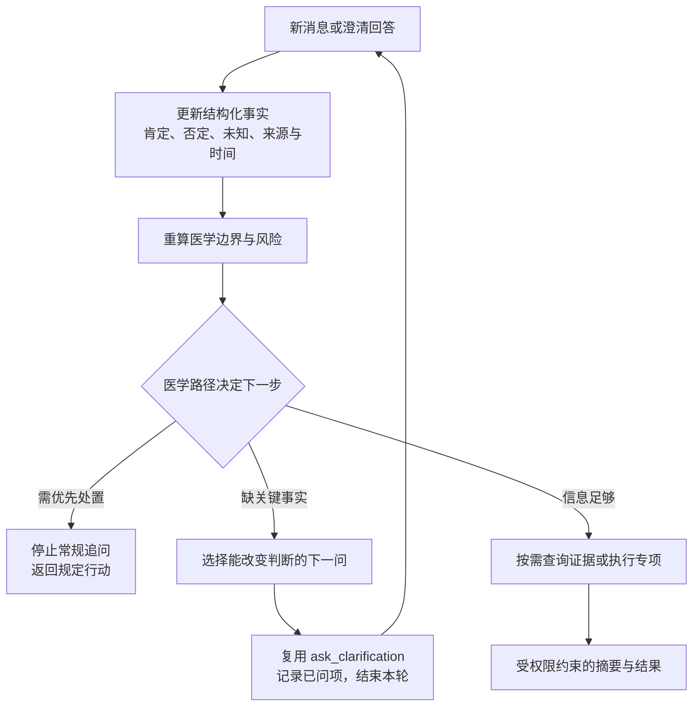

# 工程附录：DeerFlow 接入与运行约束

对应[母婴医疗引擎与平台建设方案](README.md)。本附录供研发核对机制与实施差距；接口、医学策略和强制入口装配均为拟建。

核对基线：DeerFlow `0d4925305a6330a3442dcd336ed25750aea87cbd`；工程笔记 `7e7f0410`。源码基线于 2026-09-11 复核未变。方法、画像和场景的产品职责见正文，以下说明它们如何进入实际模型请求。

分级字段沿用 `general_health`、`personalized_health`、`general_medical`、`restricted_medical`，分别对应 GH、PH、GM、RM；风险行动、缺失项和非健康范围路由独立返回。

## 1. 首轮装配与方法更新

DeerFlow 当前提供以下基础，不能把“可发现”与“已加载”混为一谈：

| 源码已有机制 | 本项目的使用方式 |
| --- | --- |
| `load_agent_soul → get_agent_soul → apply_prompt_template → create_agent` | SOUL 经转义包装进系统提示词；默认从配置文件读取，具名 Agent 经 Agent Store 读取 |
| `AgentConfig.skills` | 控制可发现、可激活的 Skill 范围，**不会自动加载全部正文或启用其工具策略** |
| `SkillActivationMiddleware` | 显式 `/skill-name` 在模型调用前以带来源标记的隐藏 HumanMessage 注入完整正文；其他 Skill 可通过发现与读取按需加载 |
| `SkillToolPolicyMiddleware` | 已激活 Skill 的工具声明同时参与模型可见性过滤与实际执行检查 |
| `DynamicContextMiddleware` | run 开始时读取用户／Agent 记忆；框架日期走 SystemMessage，用户记忆走隐藏的 HumanMessage |

因此，本项目需补**按入口和场景强制预加载必需 Skill 的装配器**：第一轮之前加载公共与场景 Skill，医生入口同时加载专属 Skill 正文，登记激活状态并绑定策略。不能只设置 `skills` 列表，也不让模型自行决定是否读取核心医生方法。这里是服务端入口选择，不伪造用户输入 `/skill-name`。

必需版本不存在、未发布或超出授权范围时，停止该入口的装配并给出可处理的状态。每次 run 固定配置与方法版本；后续模型调用继续提供必要方法，避免被历史摘要丢掉。额外资料按需读取，画像随新确认事实更新。SOUL／Skill 发布新版本后在后续 run 生效，保留回滚；紧急撤销由运行时拒绝旧版本。生产咨询不开放 `update_agent` 自修改发布配置。

[SOUL 提示词](../../../deer-flow/backend/packages/harness/deerflow/agents/lead_agent/prompt.py)中的实际代码为：

```python
# 省略注释；html 与 load_agent_soul 由所在模块导入
def get_agent_soul(agent_name: str | None, *, user_id: str | None = None) -> str:
    soul = load_agent_soul(agent_name, user_id=user_id)
    if soul:
        return f"<soul>\n{html.escape(soul, quote=False)}\n</soul>\n"
    return ""
```

下面展示**拟建的首轮请求**。Skill 名称、版本及工具名是示例；正文来自各自的 `SKILL.md`，版本和审核信息由发布清单管理：

```text
SYSTEM：平台规则说明、场景与 SOUL
<medical_policy version="1">
遵守医学边界模块的响应权限与风险处置；不改写专项核心结果。
使用本次装配清单中的已审核方法；方法始终受公共规则与场景范围约束。
</medical_policy>
<scene id="feeding_choice" version="1">
回应喂养选择与心理压力诉求；按任务需要澄清或查证据。
</scene>
<soul>你是母婴健康 AI 助手。表达简短温和，尊重用户喂养目标。</soul>

HUMAN（隐藏方法上下文）：服务端加载已发布 Skill 正文（此处节选）
<skill name="medical-common" version="3">
先回答原问题；检查已知事实；只追问能改变下一步的信息。
</skill>
<skill name="feeding-choice" version="1">
识别用户目标与相关事实；依据不足时查询；按响应权限交付下一步。
</skill>
<skill name="doctor-a-feeding-choice" version="2">
适用于医生A的喂养选择入口。先区分用户自身目标与外界压力，再组织备选。
用户目标已经明确时直接使用；方法不适用时交回场景流程。
</skill>

HUMAN（隐藏用户上下文）：相关事实
{"subject":"mother", "goal":"减少喂养选择带来的压力",
 "feeding_mode":"混合喂养", "baby_age_days":null,
 "source":"用户确认", "profile_version":12}
USER：我已经混合喂养了，家里人一直反对，怎么办？
TOOLS：medical_evidence、ask_clarification
```

公共规则说明、SOUL 和方法包来自平台发布流程；用户资料与外部证据始终作为数据处理。标签转义不等于消除提示词注入，授权与来源校验仍在运行时执行。通用医学事实由证据库维护，Skill 负责查询与使用方法，避免把全部知识复制进提示词。

## 2. 工具循环、执行检查与收尾

**SOUL 与 Skill 告诉模型怎样做；Harness 决定某一步是否真的能够发生。** 提示词里的规则用于引导，同一规则版本的执行校验负责拦截。这里的“硬性”指检查点和拒绝动作不能由模型跳过，不意味着自然语言理解或医学判断永远正确。



DeerFlow 的 `create_agent(model, tools, middleware, system_prompt, state_schema)` 提供模型／工具图。一轮工具结果影响下一轮选择，不用预先写死所有分支。公共医学检查强制执行，知识、问诊、专项按需调用；确定性计算仍留在工具内部。

| 模型试图做什么 | 在哪里、怎样拦住 | 现成机制与补建边界 |
| --- | --- | --- |
| 使用无权限的工具，或猜出隐藏工具名 | `wrap_tool_call` 在调用 handler 前拒绝，并返回错误 ToolMessage | DeerFlow 已有 Skill／工具准入；本项目接入用户、场景和医学权限 |
| 缺必需信息仍生成专项计划 | 执行前检查结构化必需项与排除条件；不执行计算，返回缺失项或不适用 | 医学检查补建，使用现成工具拦截位置 |
| 一边问用户，一边执行同批其他工具 | `after_model` 删除同批非澄清调用，再结束本轮等待回答 | 当前 ClarificationMiddleware 已实现 |
| 连续调用同一工具、无法收敛 | 循环检测与 Token 预算触发停止，交付真实未完成状态 | 现成可配置机制；医学停止条件另行补建 |
| 改写计算结果，或输出不允许的结论 | 校验结构化结果与候选答案；拒绝展示或要求受控修正 | 医学结果校验、字段直出及前端待审缓冲需补建 |
| 把工具失败当成功，或将用户纠正忘掉 | 失败保留错误结果；新事实更新状态后重算相关判断 | 异常协议与会话状态已有；医学事实合并与重算需补建 |

`before_agent` 准备本轮状态；`before_model / wrap_model_call` 装配每次请求；`after_model` 裁决整批输出；`wrap_tool_call` 管单次执行；`after_agent` 处理正常结束路径的收尾。直接跳转 END、异常或取消不能假定都会经过 `after_agent`，本项目的统一收尾需由外围执行器兜底，并避免重复记录。`before` 顺序、`after` 逆序、`wrap` 嵌套，注册顺序会改变行为。输出若已直接流给用户，事后的 `after_model` 无法撤回，展示前检查必须配合缓冲。

工具策略也不能只依靠 Skill：当前 DeerFlow 对多个上下文活跃 Skill 的显式 `allowed-tools` 取并集；显式 slash 激活优先，且有保留的框架工具。**本项目的最终可执行范围还要受“用户授权 ∩ 场景范围 ∩ 平台策略”约束，再应用 Skill 限制。** 医生 Skill 不能扩出上层范围；工具允许调用，也仍要检查本次参数和适用条件。[Skill 策略实现](../../../deer-flow/backend/packages/harness/deerflow/agents/middlewares/skill_tool_policy_middleware.py)、[工具集合语义](../../../deer-flow/backend/packages/harness/deerflow/skills/tool_policy.py)

## 3. 从澄清扩展到医学问诊

DeerFlow 已有 `ask_clarification`，支持问题、选项和表单，工具标记 `return_direct=True`。中间件返回带 `human_input` 的 ToolMessage 与 `Command(..., goto=END)`；前端收到回答后在同一会话发送下一轮消息。它结束当前 run，不使用原位置的 `interrupt()/Command(resume=...)`，也不把工具挂着等待用户。

旧笔记中的“同批普通工具可能执行”限制在当前源码已被修正，正常与格式错误的混合澄清都有[图集成测试](../../../deer-flow/backend/tests/test_clarification_drop_siblings_graph_integration.py)。非交互模式可禁用澄清，后台缺信息时须返回待补充或停止状态。

**Harness 提供提问与接续，医学问诊增加问题选择与判断路径。** 扩展内容为：`consultation_state` 保存事实、已问项、路径和版本；`medical_consultation` 返回缺失项、下一问、停止原因与摘要；问诊 Skill 指导信息收集和解释，医学规则执行必问项与停止条件。




新增信息进入后，重算边界和风险；已经回答的跳过，发生修正的更新，拒绝继续回答时保留未知。先验证少数主诉，再扩大路径覆盖。内部可能性用于选择问题，最终交付仍受响应权限约束。

专项服务沿同一循环接入：适配字段 → 服务返回结果／缺失项／不适用 → 解释或澄清 → 新状态到来后重算。奶量管理纳入一期专项适配，当前工作区未找到该服务实现，接入前需核对字段、规则和确定性程度；演示数据不算真实集成通过。长期提醒由外围系统触发，再把新状态交回医学引擎复评。

## 4. 核对来源

源码入口：[Agent 工厂](../../../deer-flow/backend/packages/harness/deerflow/agents/lead_agent/agent.py)、[Skill 激活](../../../deer-flow/backend/packages/harness/deerflow/agents/middlewares/skill_activation_middleware.py)、[动态上下文](../../../deer-flow/backend/packages/harness/deerflow/agents/middlewares/dynamic_context_middleware.py)。

其他框架：[Pi 扩展与交互](https://github.com/earendil-works/pi/blob/main/packages/coding-agent/docs/extensions.md)、[DeepSeek Harness 架构](https://github.com/deepseek-ai/deepseek-harness/blob/master/docs/architecture.md)、[提问工具](https://github.com/deepseek-ai/deepseek-harness/blob/master/packages/interaction/tool-ask-user/README.md)、[开发者预览状态](https://github.com/deepseek-ai/deepseek-harness#developer-preview)。Pi 的 `before_agent_start`、`context`、`tool_call` 支持注入与拦截，RPC 可承接交互；DeepSeek Harness 的提问工具等待回答并依赖交互 provider，接入时须匹配会话生命周期。

来源：[原始四能力方案](/Users/lute/.codex/attachments/44f4b8e7-a962-4b9c-9163-6beb16e874ba/pasted-text-1.txt)、[七图数据](../../review-query-toolkit/workbench/output/statistical-atlas-20260908/chart-data.json)、[输入准备笔记](../../../deerflow-engineering-notes/site/src/content/tutorials/zh/04-middleware-pipeline.mdx)、[输出裁决与收尾笔记](../../../deerflow-engineering-notes/site/src/content/tutorials/zh/05-middleware-return.mdx)。源码及外部项目核对日期：2026-09-10；DeerFlow 当前基线 `0d492530`，旧笔记中的澄清限制以本文核对的实现为准。
